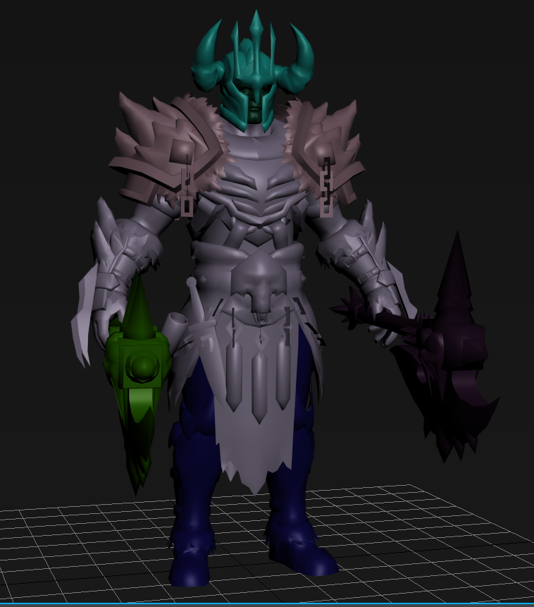

# Diablo Immortal

## Description

3D Studio Max script that imports a static 3D mesh from Blizzard's Diablo Immortal game.

## Supported fileformat
- .mesh

### Examples

## How to get the models

Use the following tool to download, extract and decode the content of the game:

[Diablo Immortal Data Tool](https://github.com/CucFlavius/DIDT)

First download the Apple/Android version of the game via the first tab.
Then go to the second tab and hit the sort button, then hit the decompress button.
Eventually you will end up with lost of files without extension, these can be ignored/deleted.

## TODO

Convert the .texture2D files into .dds files