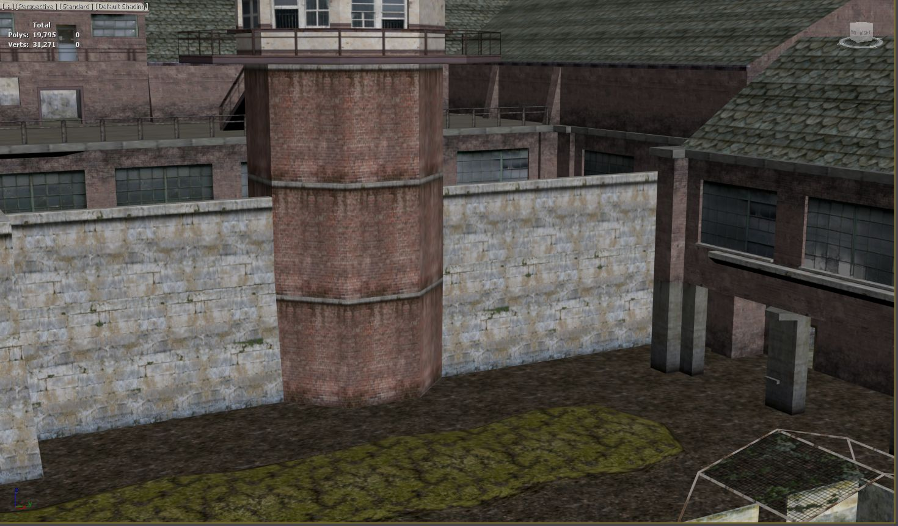
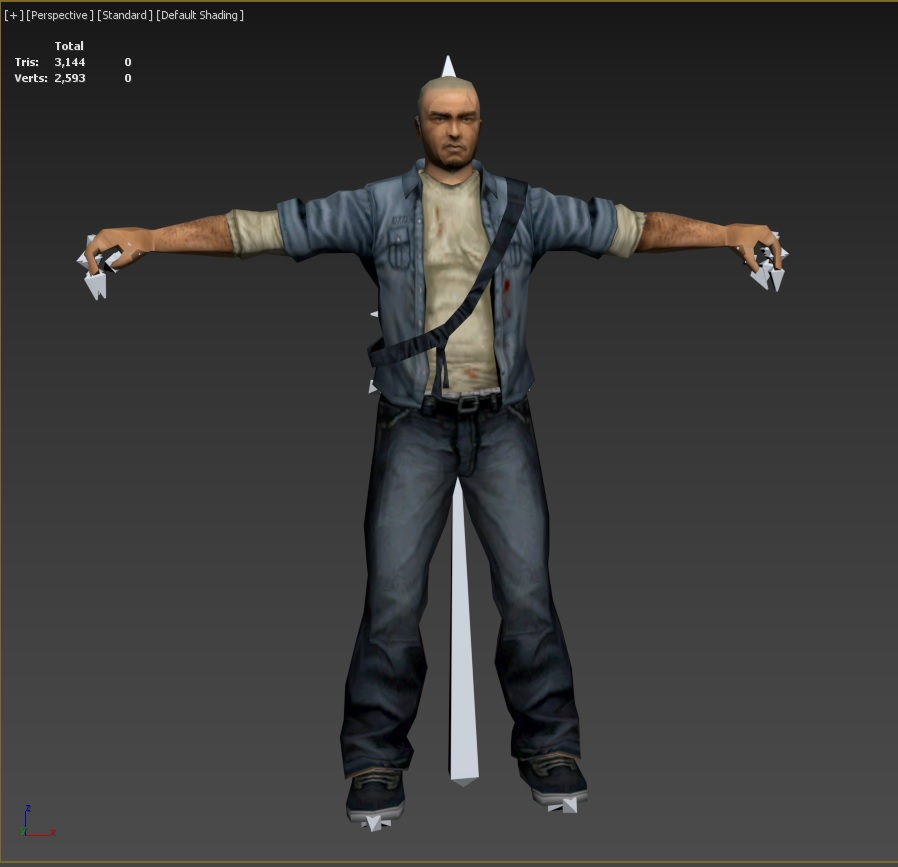
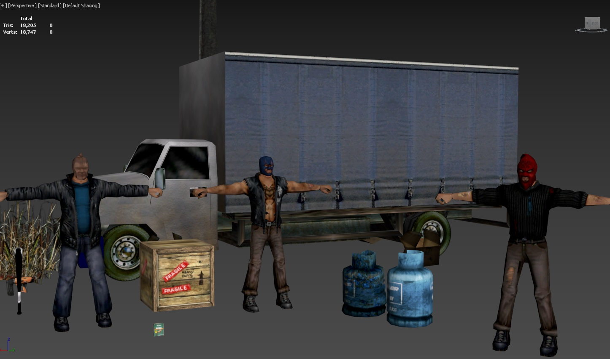

# Manhunt 1

[Official site](https://www.rockstargames.com/games/manhunt)

## TODO
- Model skinning
- Multiple model positioning and skinning

## Script
The script can be run in 3D Studio Max ( Any version )
No other scripts required

Supported file formats
- bsp (.bsp, .bsp2, .bsp3, ...)
- dff (.dff, .dff2, dff3, ...)

## Pre-Requisites
To make the script fully functional, make sure you have every TXD file ( Texture file ) exported to a single (Textures ) folder.
Open each script and paste the path to that folder.

Example
``` c#
local texturePath = @"G:\Game Dev\3D Models\Game Models\Rockstar Games\Manhunt\Textures\"
```


## Examples

### Manhunt bsp import with material support


### dff import


### dff import that contain multiple models


[Disclaimer](../../Disclaimer.md)