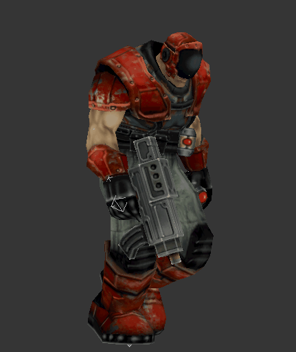

# Griffon Studios 3D Studio Max Scripts

## How to install the Warcraft III Reforged Tools

- Download the ***GriffonStudios_Warcraft_3_Reforged_Tools.ms*** and the ***GriffonStudios_Warcraft_3_Reforged_Tools*** folder content.
- Place the folder and the .ms script in the startup scripts of 3D Studio Max

    Example:

        C:\Program Files\Autodesk\3ds Max 2016\scripts\Startup\

Once you copied the content start 3D Studio Max, start 3D Studio and a ***WC3 Reforged Tools*** menu will appear.

## How to install the Griffon Studios Tools

- Download the folder content GriffonStudios and the GriffonsStudios_StartUp.ms scripts. ( not the Warcraft III Reforged Tools)
- Place them in the startup script folder of your 3D Stusio Max folder.

    Example:

        C:\Program Files\Autodesk\3ds Max 2020\scripts\Startup\

- Start 3D Studio Max
- If everything went well you should see an additional **Griffon Studios Tools**  menu.

and find additional scripts in the Utilities pane.

## Example

## Supported versions

3D Studio Max 2011 - 2020 have been tested.

## NOTE

It is possible that for some scripts, like the Starcraft 2 & Heroes of the Storm Scripts require the official Blizzard ArtTools (sometimes called StarTools).
The [Official Starcrat II Art Tools](https://news.blizzard.com/en-gb/starcraft2/10788362/starcraft-ii-art-tools-open-beta) are only fully supported for 3D Studio Max 2011. However you can download the Art Tools for 3D Studio Max 2016 here:
[SC2ArtTools2016.zip](https://drive.google.com/file/d/1-ZM4tPded4LEDnJZw7CxwKy_qTAhVR4m/view?usp=sharing)

Not all of the supported games, listed below are found in the menu, some of them are still script only.

## Supported games

- [Starcraft 2](https://starcraft2.com/en-us/)
- [Heroes of the Storm](https://heroesofthestorm.com/en-us/)
- [Diablo III](https://diablo3.blizzard.com/en-us/)
- [World of Warcraft](https://worldofwarcraft.com/en-us/)
- [Warcraft 3 Reforged](https://playwarcraft3.com/en-us/)
- [Overwatch](https://playoverwatch.com/en-us/)
- [Darksburg](https://darksburg.com/)
- [Nothgard](https://northgard.net/)
- [League of Legends](https://na.leagueoflegends.com/en-us/)

## External Tools & Resources

- [Official Starcrat II Art Tools](https://news.blizzard.com/en-gb/starcraft2/10788362/starcraft-ii-art-tools-open-beta)
- [SC2ArtTools2016.zip](https://drive.google.com/file/d/1-ZM4tPded4LEDnJZw7CxwKy_qTAhVR4m/view?usp=sharing)
- [My Modded models](https://www.sc2mapster.com/projects/taylor-mouses-stuff/files)
- [Autodesk 3D Studio Max](https://www.autodesk.com/education/home)
- [Casc Storage Explorer (Required to open Blizzard archive game files)](http://www.zezula.net/en/casc/main.html)