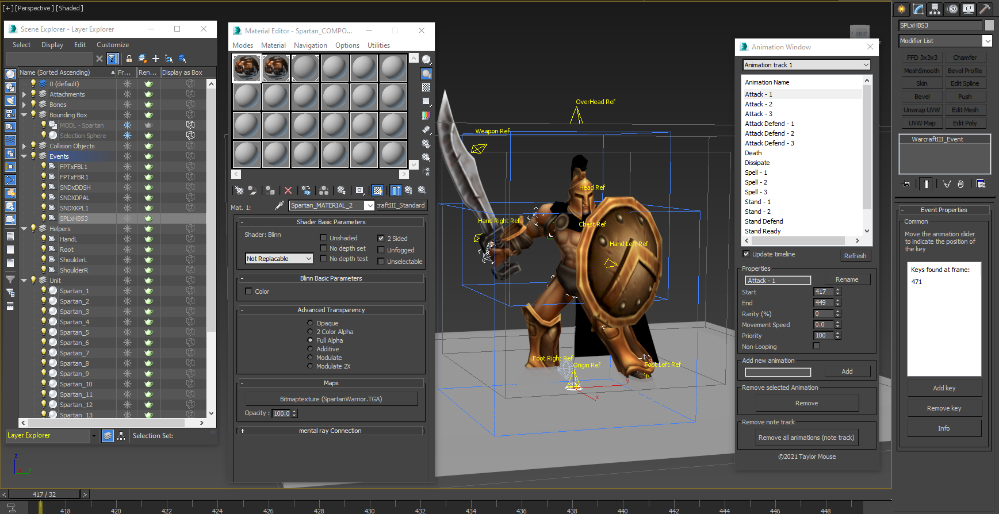
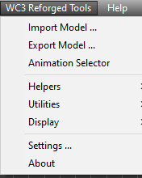
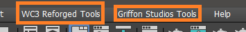
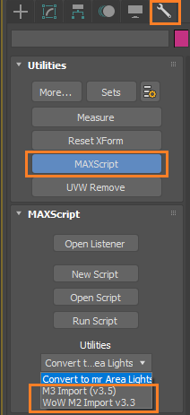

# Warcraft III Tools
## How to install

- Download the ***GriffonStudios_Warcraft_III_Tools*** folder and the ***Install_Warcraft_III_Tools.ms*** file

- Copy the folder ***GriffonStudios_Warcraft_III_Tools*** and the ***Install_Warcraft_III_Tools.ms*** files in the startup folder of your 3D Studio Max application.

    Example:

        C:\Program Files\Autodesk\3ds Max 2016\scripts\Startup\

## Optional: How to use the custom Warcraft III Icons for 3D Studio Max

- Get the 24i.bmp and the 16i.bmp images from the [MaxIcons](https://github.com/TaylorMouse/MaxScripts/tree/master/MaxIcons) folder

- Place both the "_24i.bmp" and the "_16i.bmp" in the following directory to be able to use them or so that the macro script recognizes it.

      c:\Users\<your user name>\AppData\Local\Autodesk\3dsMax\<version of max>\ENU\usericons\

- NOTE: You need to restart max to take affect.

### The icons

|Icon Name| Description|
|--|--|
|Animation Window icons| Used for opening the animation window|
|Import MDX| Used for importing the mdx file you select|
|Export MDX| Used for exporting to an mdx file you choose|
|Collision Object Toggle| Used for toggeling all collision objects at the same time|
|User Properties|Used to display and set specific properties of an object,like collision object &  billboarding|
|Tools Window|Contains the major functionality in one window, like import, export, material editor cleanup, and some nifty stuff for using with IK Solvers ( see upcomig tutorial and guidelines for more info)

## Start Max

- This will install the following plugins:

  - Warcraft III Standard Material *(found in the Material Editor)*
  - Warcraft III Event *(found in Helpers in the Create tab )*
  - Warcraft III Attachment *(found in Helpers in the Create tab )*
  - Warcraft III Ribbon *(found in Helpers in the Create tab )*
  - Warcraft III Behavior *(found in Helpers in the Create tab )*

- This will install the following tools:
  
  - Animation Window
  - User Property Window

- This will install the following macros:
  - Import MDX
  - Export MDX
  - Toggle Collision Objects
  - Open Animation Window
  - Open User Property Window

- See the following video on how to install a macro and create a button for it on a custom toolbar:
[How to install a macro in 3D Studio Max](https://www.youtube.com/watch?v=kvaAY8TCRdo)

## Import MDX

**IMPORTANT**
- Prior to importing the model, convert the .blp files to .TGA, use the BLPconv.exe to do this conversion. Just drag and drop the .blp file onto the exe after you extracted it from the zip file.
- Supprts Version 800 only, for version 1000 ( Reforged ) seen the Reforged tools

- Press the Import button

- After the import is done, you should be able to have the following

- The model I used can be downloaded from [The Hive Workshop - Spartan Warrior](https://www.hiveworkshop.com/threads/spartan-warrior.333698/)

**IMPORTANT**
A more in dept description will follow once all of the tools have been covered together with a tutorial.

## How to install the Warcraft 3 Reforged Tools

- Download the ***GriffonStudios_Warcraft_3_Reforged_Tools.ms*** and the ***GriffonStudios_Warcraft_3_Reforged_Tools*** folder content.
- Place the folder and the .ms script in the startup scripts of 3D Studio Max

    Example:

        C:\Program Files\Autodesk\3ds Max 2016\scripts\Startup\

Once you copied the content start 3D Studio Max, start 3D Studio and a ***WC3 Reforged Tools*** menu will appear.

## How to install the Griffon Studios Tools

- Download the folder content GriffonStudios and the GriffonsStudios_StartUp.ms scripts. ( not the Warcraft III Reforged Tools)
- Place them in the startup script folder of your 3D Stusio Max folder.

    Example:

        C:\Program Files\Autodesk\3ds Max 2020\scripts\Startup\

- Start 3D Studio Max
- If everything went well you should see an additional **Griffon Studios Tools**  menu.

and find additional scripts in the Utilities pane.

## Supported versions

3D Studio Max 2011 - 2020 have been tested.

## NOTE

It is possible that for some scripts, like the Starcraft 2 & Heroes of the Storm Scripts require the official Blizzard ArtTools (sometimes called StarTools).
The [Official Starcrat II Art Tools](https://news.blizzard.com/en-gb/starcraft2/10788362/starcraft-ii-art-tools-open-beta) are only fully supported for 3D Studio Max 2011. However you can download the Art Tools for 3D Studio Max 2016 here:
[SC2ArtTools2016.zip](https://drive.google.com/file/d/1-ZM4tPded4LEDnJZw7CxwKy_qTAhVR4m/view?usp=sharing)

Not all of the supported games, listed below are found in the menu, some of them are still script only.

## Supported games

- [Starcraft 2](https://starcraft2.com/en-us/)
- [Heroes of the Storm](https://heroesofthestorm.com/en-us/)
- [Diablo III](https://diablo3.blizzard.com/en-us/)
- [World of Warcraft](https://worldofwarcraft.com/en-us/)
- [Warcraft 3 Reforged](https://playwarcraft3.com/en-us/)
- [Overwatch](https://playoverwatch.com/en-us/)
- [Darksburg](https://darksburg.com/)
- [Nothgard](https://northgard.net/)
- [League of Legends](https://na.leagueoflegends.com/en-us/)

## External Tools & Resources

- [Official Starcrat II Art Tools](https://news.blizzard.com/en-gb/starcraft2/10788362/starcraft-ii-art-tools-open-beta)
- [SC2ArtTools2016.zip](https://drive.google.com/file/d/1-ZM4tPded4LEDnJZw7CxwKy_qTAhVR4m/view?usp=sharing)
- [My Modded models](https://www.sc2mapster.com/projects/taylor-mouses-stuff/files)
- [Autodesk 3D Studio Max](https://www.autodesk.com/education/home)
- [Casc Storage Explorer (Required to open Blizzard archive game files)](http://www.zezula.net/en/casc/main.html)
