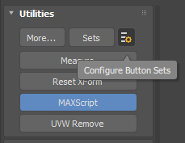
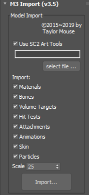
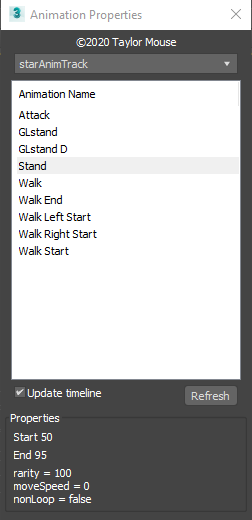
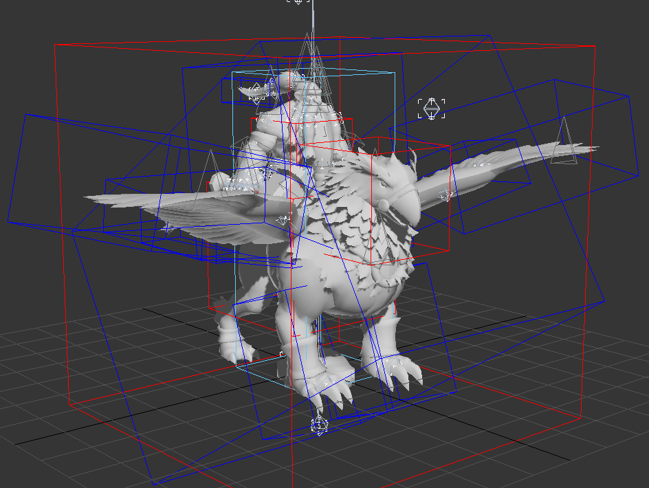
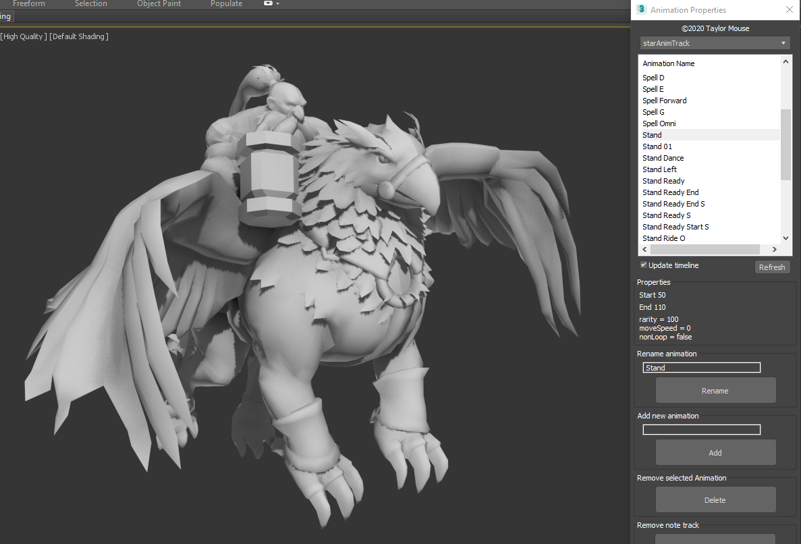

# Import M3 files into MAX

[Table of contents](#import-m3-files-into-max)

- [Introduction](#introduction)
- [Supported file formats](#supported-file-formats)
- [Prerequisites](#prerequisites)
- [Using the Script](#using-the-script)
  - [Importing animations](#importing-animations)
  - [Missing Textures](#missing-textures)
- [Additional features](#additional-features)
  - [Layer Explorer](#layer-explorer)


## Introduction

The script should work in any 3D Studio Max version (2011 and above)

There is no export fuctionality because Blizzard has made official exporting functionality for Max 2011 & Max 2016.

## Supported file formats

Starcraft 2 and Heroes of the Storm share the same file formats. These file formats are:

- m3
- m3a

The m3 file can contain both meshes and animations but the m3a file only contains animation data. Therefor it is important to use the correct m3a file with the corret m3 file.

## Prerequisites

Obviously you need to own one of the game(s).

- [Starcraft II](https://starcraft2.com/)
- [Heroes of the Storm](https://heroesofthestorm.com/)

You need the following tool to extract the stuff you want

- [CascView](http://www.zezula.net/download/cascview_en.zip)

## Using the Script

Put the script in the startup folder of your 3D Studio Max.

```cmd
C:\Program Files\Autodesk\3ds Max <version>\scripts\startup\
```

This will load the script automatically during startup.

Start 3D Studio Max and navigate to the Utilities pane.


Select MAXScript (if you do not see this button it can be selected by pressing the More... button)



When you selected MAXScript, you will get a dropdown list with the scripts installed as a utility. Select the **M3 Import (v3.5)**


This will bring up a Utility in this pane.

**NOTE** If you are not using version 2011 or 2016 WITH the ArtTools, uncheck the "Use SC2 ArtTools"



Select the file you want to import and press the import button.

As an example I imported the banshee.m3 model.


To check the animations, you can use my Animation Properties tool, when you don't have the Art Tools installed or use Blizzard's Animation Properties.



Select one of the animations to play.

### Importing animations

For Heroes of the Storm, the animation may not be included in the same file as the model.

This is usually found in another folder with a name that ends with "_requiredanims" or "_facialanims". The extension of that file is .m3a


So first import the .m3 file, then the .m3a file the same way. The script will know what to animate.

When importing (from the example) the hero Falstad you will first end up with no animations.

**NOTE** that I didn't import the textures for this example, as they are in a long list. You can always add them later.



So use the utility again and select the m3a file from the required anims folder.


Import the file, this may take some time as every single bone in the scene will be updated.

In the MAXScript Listener you will see what animations have been added.

For Falstad these are:

```python
- Animation 'Stand' { start:50, end:110 }
- Animation 'Stand 01' { start:210, end:330 }
- Animation 'Walk A 01' { start:430, end:540 }
- Animation 'Spell C' { start:640, end:673 }
- Animation 'Fidget' { start:773, end:893 }
- Animation 'Spell Channel' { start:993, end:1043 }
- Animation 'Taunt' { start:1143, end:1218 }
- Animation 'Stand Start' { start:1318, end:1348 }
- Animation 'Attack' { start:1448, end:1508 }
- Animation 'Attack 01' { start:1608, end:1668 }
- Animation 'Walk A K' { start:1768, end:1818 }
- Animation 'Walk A Ride M' { start:2068, end:2098 }
- Animation 'Stand Ride O' { start:2328, end:2388 }
- Animation 'Stand Ready' { start:2648, end:2698 }
- Animation 'Spell A' { start:2798, end:2834 }
- Animation 'Stun' { start:2934, end:3018 }
- Animation 'Stand Ready End' { start:3118, end:3148 }
- Animation 'Flail Back' { start:3248, end:3278 }
- Animation 'Flail Forward' { start:3378, end:3408 }
- Animation 'Flail' { start:3508, end:3538 }
- Animation 'Spell Omni' { start:3638, end:3674 }
- Animation 'Spell Forward' { start:3774, end:3810 }
- Animation 'Stand Dance' { start:3910, end:4060 }
- Animation 'Stand Left' { start:4160, end:4220 }
- Animation 'Stand Right' { start:4320, end:4380 }
- Animation 'Walk Start Ride' { start:4480, end:4513 }
- Animation 'Stand S' { start:4613, end:4673 }
- Animation 'Stand Ready S' { start:4773, end:4822 }
- Animation 'Stand Ready Start S' { start:4922, end:4952 }
- Animation 'Stand Ready End S' { start:5052, end:5082 }
- Animation 'Stand Victory' { start:5182, end:5257 }
- Animation 'Walk End Ride' { start:5357, end:5377 }
- Animation 'Spell D' { start:5477, end:5572 }
- Animation 'Spell E' { start:5672, end:5762 }
- Animation 'Spell G' { start:5862, end:5922 }
```

or



### Missing Textures

If you are missing textures, to know which ones, you can check the MAXScript Listener (press F11 to open)

For Falstad these are

```python
"[INFO] Looking for F:\Blizzard\Heroes Of The Storm\Assets\Textures\Storm_Hero_Gryphon_Diff.dds"
"F:\Blizzard\Heroes Of The Storm\Assets\Textures\Storm_Hero_Gryphon_Diff.dds"
"[WARNING] Texture was not found ! (F:\Blizzard\Heroes Of The Storm\Assets\Textures\Storm_Hero_Gryphon_Diff.dds)"
"[INFO] Looking for F:\Blizzard\Heroes Of The Storm\Assets\Textures\Storm_Hero_Gryphon_Spec.dds"
"F:\Blizzard\Heroes Of The Storm\Assets\Textures\Storm_Hero_Gryphon_Spec.dds"
"[WARNING] Texture was not found ! (F:\Blizzard\Heroes Of The Storm\Assets\Textures\Storm_Hero_Gryphon_Spec.dds)"
"[INFO] Looking for F:\Blizzard\Heroes Of The Storm\Assets\Textures\Storm_Hero_Gryphon_Emis.dds"
"F:\Blizzard\Heroes Of The Storm\Assets\Textures\Storm_Hero_Gryphon_Emis.dds"
"[WARNING] Texture was not found ! (F:\Blizzard\Heroes Of The Storm\Assets\Textures\Storm_Hero_Gryphon_Emis.dds)"
"[INFO] Looking for F:\Blizzard\Heroes Of The Storm\Assets\Textures\Silver_Reflection.dds"
"F:\Blizzard\Heroes Of The Storm\Assets\Textures\Silver_Reflection.dds"
"[WARNING] Texture was not found ! (F:\Blizzard\Heroes Of The Storm\Assets\Textures\Silver_Reflection.dds)"
"[INFO] Looking for F:\Blizzard\Heroes Of The Storm\Assets\Textures\Storm_Hero_Gryphon_Spec.dds"
"F:\Blizzard\Heroes Of The Storm\Assets\Textures\Storm_Hero_Gryphon_Spec.dds"
"[WARNING] Texture was not found ! (F:\Blizzard\Heroes Of The Storm\Assets\Textures\Storm_Hero_Gryphon_Spec.dds)"
"[INFO] Looking for F:\Blizzard\Heroes Of The Storm\Assets\Textures\Storm_Hero_Gryphon_Norm.dds"
"F:\Blizzard\Heroes Of The Storm\Assets\Textures\Storm_Hero_Gryphon_Norm.dds"
"[WARNING] Texture was not found ! (F:\Blizzard\Heroes Of The Storm\Assets\Textures\Storm_Hero_Gryphon_Norm.dds)"
"[INFO] Looking for F:\Blizzard\Heroes Of The Storm\Assets\Textures\Storm_Hero_Falstad_StormLord_Diff.dds"
"F:\Blizzard\Heroes Of The Storm\Assets\Textures\Storm_Hero_Falstad_StormLord_Diff.dds"
"[WARNING] Texture was not found ! (F:\Blizzard\Heroes Of The Storm\Assets\Textures\Storm_Hero_Falstad_StormLord_Diff.dds)"
"[INFO] Looking for F:\Blizzard\Heroes Of The Storm\Assets\Textures\Storm_Hero_Falstad_Spec.dds"
"F:\Blizzard\Heroes Of The Storm\Assets\Textures\Storm_Hero_Falstad_Spec.dds"
...
```

Extract them and apply them or extract them beforehand and reimport the process to get autoapply of the textures.

## Additional features

### Layer Explorer

The script imports the objects in Layers. This means, you can turn the visibility on and off for these layers to have a better view in 3D Studio Max

Use the "Toggle Layer Explorer" to do this, I assigned the "L" hotkey to open and close it.


